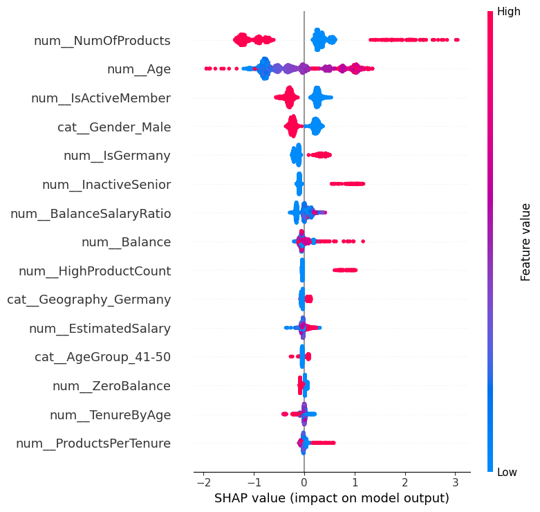

# Bank Customer Churn Prediction

End-to-end churn prediction system for a bank's 10,000 customers — XGBoost model (ROC-AUC 0.87), SHAP explainability, and a per-customer risk-tier decision layer with recommended retention actions.

## Overview

Banks lose customers quietly — most churn without ever filing a complaint. This project builds a full pipeline that goes beyond "will this customer churn?" and answers **"which customers, why, and what should we do about it?"**

- **Dataset:** [IBM "Churn Modelling"](https://www.kaggle.com/datasets/shrutimechlearn/churn-modelling) sample — 10,000 real bank customers (France, Germany, Spain)
- **Target:** `Exited` (1 = churned, 0 = stayed) — binary classification
- **Overall churn rate:** ~20.4% (imbalanced)

## Pipeline

1. **EDA** — distribution checks, churn rate by demographic/behavioral segment, correlation analysis
2. **Feature engineering** — `BalanceSalaryRatio`, `HighProductCount` (3+ products), `IsGermany`, `InactiveSenior`, `TenureByAge`, `ProductsPerTenure`, `ZeroBalance`, and binned `CreditScoreBin` / `AgeGroup`
3. **Imbalance handling** — compared `class_weight='balanced'`, `scale_pos_weight`, and SMOTE
4. **Model training & tuning** — `RandomizedSearchCV` (5-fold stratified CV) across 3 model families
5. **Explainability** — SHAP (TreeExplainer) for global and per-customer feature attribution
6. **Decision system** — per-customer risk tier, top 3 SHAP-based reasons, and a tailored recommended action
7. **Reporting** — packaged into a stakeholder-ready Excel workbook

## Results

| Model | ROC-AUC | PR-AUC |
|---|---|---|
| **XGBoost (tuned)** ✅ | **0.870** | **0.714** |
| XGBoost + SMOTE | 0.865 | 0.715 |
| Random Forest (tuned) | 0.861 | 0.706 |
| Logistic Regression (baseline) | 0.850 | 0.689 |

XGBoost with `scale_pos_weight` was selected as the production model.

### Top churn drivers (global SHAP importance)

1. **NumOfProducts** — 3+ products correlates with very high churn (signals a service/cross-sell conflict, not loyalty)
2. **Age** — churn rises sharply for older customers, especially 45–60
3. **IsActiveMember** — inactive members churn noticeably more
4. **Gender** — female customers churn more than male customers
5. **Geography (Germany)** — Germany churns at a notably higher rate than France/Spain

## Decision system

Every customer in the holdout set gets:

| Field | Description |
|---|---|
| `ChurnProbability` | Model's predicted probability of churn |
| `RiskTier` | `Critical` / `High` / `Medium` / `Low` (probability thresholds) |
| `TopReason1-3` | Top 3 SHAP-driven factors for that customer |
| `RecommendedAction` | Tailored next step (not one-size-fits-all) |

**Risk tier validation** (does the model actually separate churners?):

| RiskTier | Customers | Actual churn rate |
|---|---|---|
| Critical | 317 | **70.7%** |
| High | 391 | 26.6% |
| Medium | 653 | 9.6% |
| Low | 639 | 2.5% |

**Recommended actions are driver-specific**, e.g. a customer with 3+ products gets flagged for immediate relationship-manager review instead of a generic upsell offer.

## Repo structure
bank-customer-churn-prediction/
├── README.md
├── requirements.txt
├── notebooks/
│ └── churn_project.ipynb # full pipeline, runnable end-to-end
├── src/
│ ├── 01_features.py # feature engineering
│ ├── 02_train.py # model training & tuning
│ ├── 03_explain.py # SHAP explainability
│ └── 05_report.py # Excel report generation
├── outputs/
│ ├── shap_summary.png
│ └── customer_risk_report.csv # final per-customer decisions
└── reports/
└── churn_retention_report.xlsx

## Setup

\`\`\`bash
git clone https://github.com/sajaakool7-ds/bank-customer-churn-risk-prediction.git
cd bank-customer-churn-risk-prediction
pip install -r requirements.txt
\`\`\`

Place `Churn_Modelling.csv` in the project root, then run the pipeline in order:

\`\`\`bash
python src/01_features.py
python src/02_train.py
python src/03_explain.py
python src/05_report.py
\`\`\`

Or open `notebooks/churn_project.ipynb` to run the full pipeline interactively with EDA plots inline.

## Tech stack

`pandas` · `scikit-learn` · `xgboost` · `imbalanced-learn` (SMOTE) · `shap` · `matplotlib` · `openpyxl`

## Next steps

- Cost-benefit layer: expected financial value of each recommended action
- Extend the decision report to the full 10,000-customer base, not just the 20% test holdout
- Monitor model drift as customer behavior shifts over time
